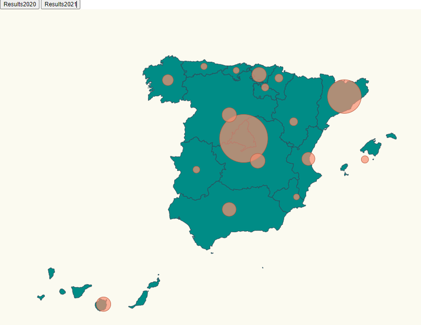

# COVID-19SpainDataVisualization using D3js
In this repository im going to add some D3js data visualization of the COVID-19 data in Spain. Im going to create a Spain map that contains a graphic representation of COVID data in 2020 and 2021. You will be able to change the view of both representation using the buttons you will find above the map.

 
